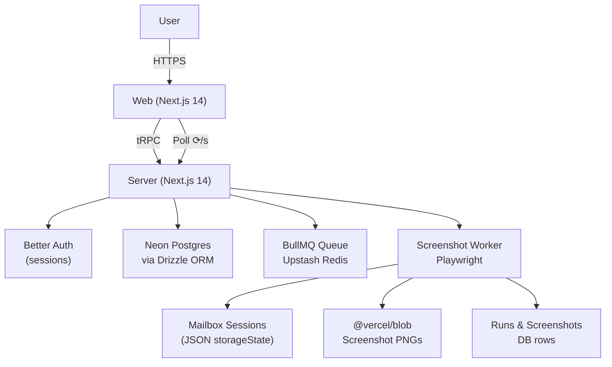
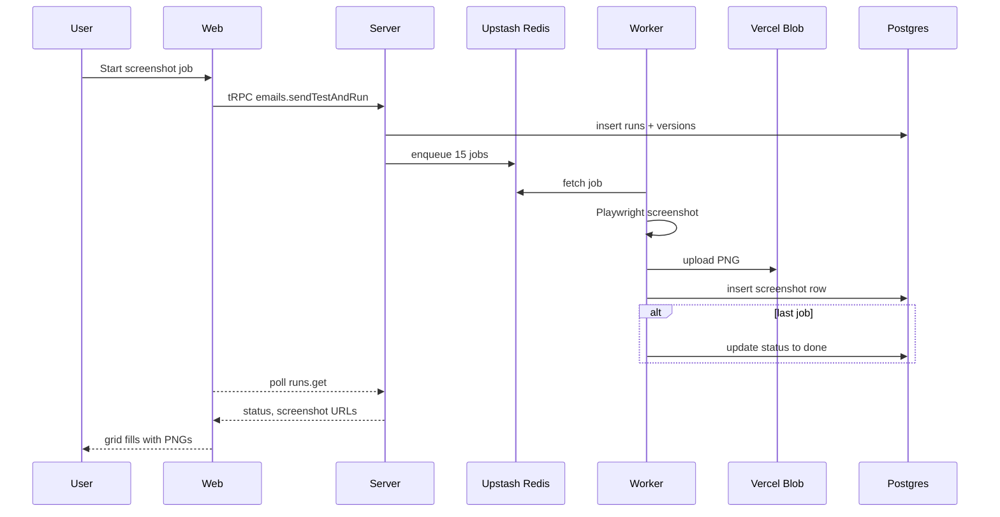

<!-- Logo Placeholder -->
<p align="center">
  <h1 align="center"></h1>

  **diff.email** is an end-to-end playground for HTML email developers. Author in HTML or JSX in a rich editor experience (customized Monaco editor), preview (iframe injection via esbuild-wasm) and generate pixel-perfect screenshots (using Playwright) across real web-based email clients and browser engines.
</p>

---

## Table of Contents

- [Table of Contents](#table-of-contents)
- [✨ Why diff.email?](#-why-diffemail)
- [🚀 Feature Highlights](#-feature-highlights)
- [🏗️ Architecture at a Glance](#️-architecture-at-a-glance)
  - [Runtime Units](#runtime-units)
- [🛠️ Tech Stack](#️-tech-stack)
- [📂 Monorepo Layout](#-monorepo-layout)
- [⚙️ Prerequisites](#️-prerequisites)
- [▶️ Quick Start](#️-quick-start)
- [🔑 Environment Variables](#-environment-variables)
- [🗄 Database \& Migrations](#-database--migrations)
- [📸 Screenshot Pipeline](#-screenshot-pipeline)
- [🛣️ Roadmap](#️-roadmap)
- [🤝 Contributing](#-contributing)

---

## ✨ Why diff.email?

Email clients are notorious for rendering the *same* HTML in wildly different ways. Diff.email lets you:

1. **Write once** – author raw HTML or [React Email](https://react.email) markup.
2. **Preview instantly** – live iframe updates on every keystroke.
3. **Screenshot everywhere** – 30 combinations (3 engines × 5 clients × 2 light/dark color-schemes) captured by headless Playwright—no emulation.
4. **Track changes** – every save creates a version that can be diff-viewed against historical versions.
5. **Ship confidently** – background jobs continue even if you close the tab.

All in one, open-source toolbox—no more juggling SaaS tabs or waiting for email testing services.

---

## 🚀 Feature Highlights

- ✉️ **Author** raw HTML *or* JSX, with support for [React Email](https://react.email/) components.
- 💡 **Live Preview** in a sandboxed `<iframe>`.
- 📸 **One-click run** captures Gmail, Outlook, Yahoo, AOL & iCloud across Chromium, Firefox & WebKit.
- 🕶 **Dark-mode** toggle that toggles both the live preview and screenshots to their dark mode equivalents.
- 🕑 **Automatic versioning** & diffs between any two saves.
- 🔑 **Better Auth** user accounts (Postgres adapter).
- 🌩 **Serverless-friendly**—runs entirely on Vercel (or any Node 18+ host).

---

## 🏗️ Architecture at a Glance



### Runtime Units

1. **apps/web** – Public-facing UI (React + Next.js).
2. **apps/server** – tRPC API *plus* the integrated screenshot worker (Node runtime + Next.js).
3. **packages/shared** – Re-usable TypeScript types & utilities (no deployment, imported into web/server).
4. **packages/logger** – Shared pino logging instance used across packages for consistent log formatting.

> The worker used to be a third app. It now lives inside the server package for simpler deployments.

---

## 🛠️ Tech Stack

| Layer              | Choice                                   | Notes |
|--------------------|------------------------------------------|-------|
| Front-end          | **Next.js 14** (App Router)              | React Server Components, Tailwind + shadcn/ui |
| Back-end & Worker  | **Next.js 14** (API routes, Node runtime)| Houses tRPC & Playwright worker |
| Auth               | **Better Auth** (Postgres adapter)       | Lightweight sessions |
| Database           | **Neon Postgres**                        | Serverless Postgres |
| ORM                | **Drizzle ORM**                          | SQL-first, type-safe |
| Queue              | **BullMQ** + **Upstash Redis**           | Durable job storage |
| Object Store       | **@vercel/blob**                         | Public CDN URLs for screenshots |
| Screenshots        | **Playwright** (Chromium/Firefox/WebKit) | Real engines, not emulation |
| Dev UX             | **pnpm**, **Biome**, **shadcn/ui**       | Fast installs, zero-config formatting |

*Scope guard: Please keep the stack above—no Bun, Prisma, MongoDB, etc.*

---

## 📂 Monorepo Layout

```text
.
├── apps/
│   ├── server/   # API routes, tRPC routers & Playwright worker
│   └── web/      # Next.js front-end
├── packages/
│   ├── shared/   # Shared TS types & helpers
│   └── logger/   # Pino instance used across packages
├── drizzle/      # SQL migrations (generated)
└── …
```

---

## ⚙️ Prerequisites

- **Node 18** or newer
- **pnpm 8** or newer (`corepack enable && corepack prepare pnpm@latest --activate`)
- A **Postgres** database (Neon free tier works great)
- An **Upstash Redis** database
- A **Vercel Blob** store (free tier)
- **Playwright browsers** downloaded locally *or* `PLAYWRIGHT_BROWSERS_PATH` configured in CI

---

## ▶️ Quick Start

```bash
# 1. Clone & install deps
$ git clone https://github.com/brandonmcconnell/diff-email.git
$ cd diff-email
$ pnpm install

# 2. Copy env templates & fill in your secrets
$ cp apps/server/.env.example apps/server/.env
$ cp apps/web/.env.example    apps/web/.env

# 3. Push the database schema (Neon)
$ pnpm --filter server db:push   # creates tables

# 4. Run the whole stack (concurrently)
$ pnpm dev          # == web:dev + server:dev

# 5. Open http://localhost:3001 and sign up
```

Individual targets:

```bash
pnpm dev:server   # Next.js API + worker on :3000
pnpm dev:web      # RSC front-end on :3001
```

---

## 🔑 Environment Variables

| Variable | Used by | Description |
|----------|---------|-------------|
| `DATABASE_URL`               | server | Postgres connection string |
| `UPSTASH_REDIS_TLS_URL`      | server | TLS Redis URL (BullMQ) |
| `UPSTASH_REDIS_REST_TOKEN`   | server | REST token for Upstash bitmap |
| `BLOB_READ_WRITE_TOKEN`      | server | Read/write token for Vercel Blob |
| `RESEND_API_KEY`             | server | Transactional email sendouts |
| `BETTER_AUTH_SECRET`         | both   | Auth session encryption |
| `NEXT_PUBLIC_SERVER_URL`     | web    | Origin URL for API calls |
| `PLAYWRIGHT_BROWSERS_PATH`*  | server | (optional) custom browser cache |

*If unset, Playwright falls back to its default cache (~/.cache/ms-playwright).

---

## 🗄 Database & Migrations

- Schema lives in `apps/server/src/db/schema/` (Drizzle).
- Generate TypeScript types & SQL snapshots:
  ```bash
  pnpm --filter server db:generate
  ```
- Push or migrate:
  ```bash
  pnpm --filter server db:push      # destructive sync (dev only)
  pnpm --filter server db:migrate   # safe migration in prod
  ```

---

## 📸 Screenshot Pipeline

1. **User clicks "Save & Run".**
2. `versions.save` creates a new HTML snapshot.
3. `runs.create` inserts a `runs` row, enqueues 15 BullMQ jobs.
4. **Worker (inside the server app)** picks up each job, launches Playwright with pre-cached mailbox sessions.
5. Screenshot PNG ➜ upload to `@vercel/blob` ➜ insert into `screenshots` table.
6. When the last job finishes, the run flips to `done`, and the UI grid automatically refreshes via React-Query.



---

## 🛣️ Roadmap

- [ ] Outlook/Yahoo/AOL deep-link helpers (Gmail finished)
- [ ] Automatic dark-mode screenshot runs
- [ ] Run history & diff viewer UI
- [ ] Vercel Cron job to refresh mailbox cookies weekly
- [ ] GitHub Action: type-check, lint, unit tests
- [ ] see [`FUTURE.md`](./FUTURE.md) for the full (& growing) list

---

## 🤝 Contributing

1. Fork ➜ create a feature branch ➜ PR.
2. Follow the Biome/TypeScript rules: `pnpm check`.
3. Ensure `pnpm -r test` & `pnpm -r typecheck` are green.
4. Be excellent to each other.
